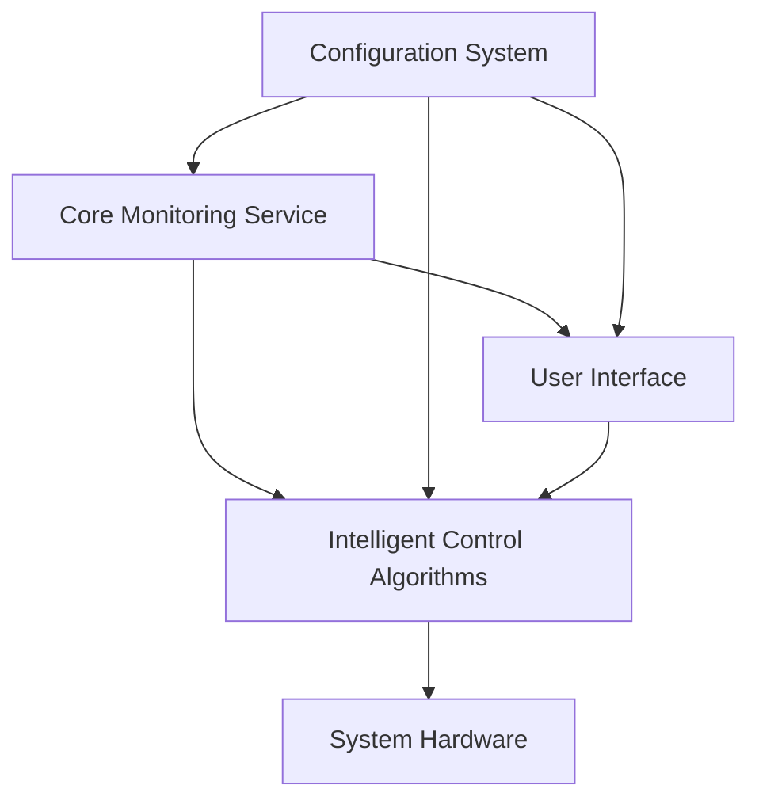

# Steam Deck Autonomous Power Management System - Architecture

## Overview

This document outlines the architecture for an autonomous power management system for the Steam Deck, designed to optimize battery life while maintaining performance based on user preferences and system conditions.

## Technology Stack

- **Core Language**: Python 3.9+
- **System Service**: systemd service
- **Hardware Interface**: sysfs, procfs, and specific Steam Deck drivers
- **UI Framework**: PyQt6 for desktop interface
- **Configuration**: JSON/YAML files
- **Packaging**: Flatpak
- **Logging**: Python logging module with systemd journal integration
- **Inter-process Communication**: Unix domain sockets

## Component Architecture

### 1. Core Monitoring Service

**Purpose**: Continuously monitor system parameters and provide data to other components.

**Technologies**: 
- Python systemd service
- Hardware interfaces (sysfs, procfs)
- Threading for concurrent monitoring

**Responsibilities**:
- Battery status (level, charging state, health)
- CPU temperature and utilization
- GPU temperature and utilization
- System power consumption
- Display brightness level

**Implementation Details**:
- Runs as a systemd service with root privileges for hardware access
- Exposes data through a Unix domain socket
- Publishes updates at configurable intervals (default: 1 second)
- Handles errors gracefully with fallback values

### 2. Intelligent Control Algorithms

**Purpose**: Adjust system parameters based on monitored data and user preferences.

**Technologies**:
- Python with numpy for calculations
- Rule-based decision engine
- PID controllers for smooth adjustments

**Responsibilities**:
- CPU frequency scaling based on utilization and temperature
- GPU frequency scaling based on utilization and temperature
- Display brightness adjustment based on ambient light and battery level
- Fan speed control (if applicable)
- Profile switching based on usage patterns

**Implementation Details**:
- Runs as a separate systemd service or integrated with monitoring service
- Receives data from monitoring service via Unix socket
- Applies user-configured profiles and rules
- Implements hysteresis to prevent rapid adjustments
- Provides manual override capability

### 3. Configuration System

**Purpose**: Manage user preferences, profiles, and system settings.

**Technologies**:
- JSON/YAML for configuration files
- Python configuration parser
- File system watchers for live updates

**Responsibilities**:
- Store user preferences (profiles, thresholds, behaviors)
- Manage multiple power profiles (performance, balanced, battery saver)
- Handle configuration validation
- Provide default configurations
- Support configuration hot-reloading

**Implementation Details**:
- Configuration files stored in `/etc/steamdeck-power-manager/` (system) and `~/.config/steamdeck-power-manager/` (user)
- Schema validation for configuration files
- Profile inheritance system (user profiles can extend system profiles)
- Configuration GUI integrated with settings window

### 4. User Interface

**Purpose**: Provide user interaction points for configuration and status monitoring.

**Technologies**:
- PyQt6 for GUI components
- System tray icon using Qt SystemTrayIcon
- Desktop notifications via libnotify

**Components**:
- System tray icon showing current battery status and profile
- Settings window for configuration management
- Status window showing real-time system metrics
- Quick profile switcher

**Implementation Details**:
- Lightweight interface that communicates with backend services
- Uses Unix sockets for communication with services
- Supports both mouse and keyboard navigation
- Respects system theme and accessibility settings

### 5. Installation System

**Purpose**: Package and distribute the application via Flatpak.

**Technologies**:
- Flatpak manifest files
- Build scripts for packaging
- systemd unit files

**Responsibilities**:
- Bundle all necessary dependencies
- Install systemd services
- Set up appropriate permissions
- Handle updates

**Implementation Details**:
- Flatpak manifest targeting the KDE runtime
- systemd service files for monitoring and control services
- D-Bus permissions for system integration
- Desktop file for application discovery

### 6. Logging and Error Handling

**Purpose**: Provide comprehensive logging and robust error handling.

**Technologies**:
- Python logging module
- systemd journal integration
- Exception handling patterns

**Responsibilities**:
- Log system events and errors
- Provide debug information for troubleshooting
- Handle service failures gracefully
- Alert users to critical issues

**Implementation Details**:
- Multi-level logging (debug, info, warning, error, critical)
- systemd journal integration for system-level logging
- Log rotation to prevent disk space issues
- Error reporting with context information

## Component Interactions

## Data Flow

1. Monitoring service reads hardware data at regular intervals
2. Data is processed by control algorithms using configured rules
3. Control algorithms adjust system parameters as needed
4. UI displays current status and allows user interaction
5. Configuration system provides settings to all components
6. Logging system captures events and errors throughout

## Security Considerations

- Services run with minimal required privileges
- Configuration files have appropriate permissions
- Input validation on all user-provided data
- Secure communication between components

## Performance Considerations

- Lightweight monitoring with minimal system impact
- Efficient algorithms for real-time decisions
- Caching of frequently accessed data
- Asynchronous operations where possible